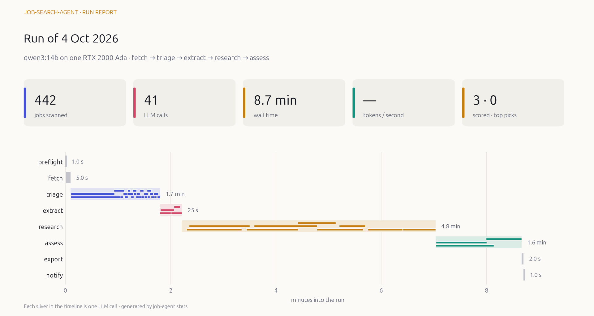
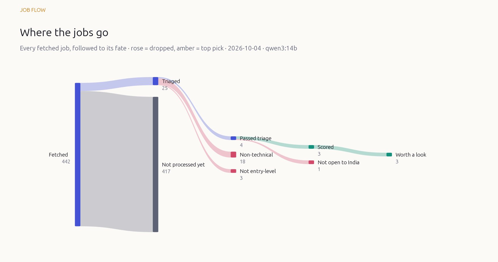
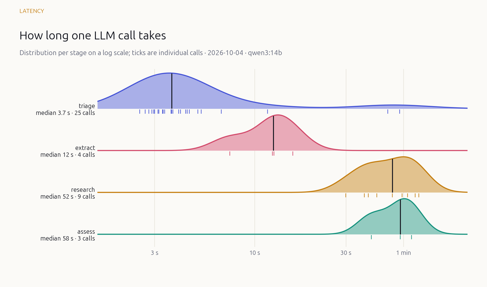
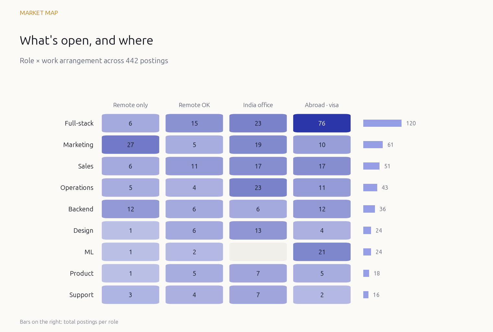
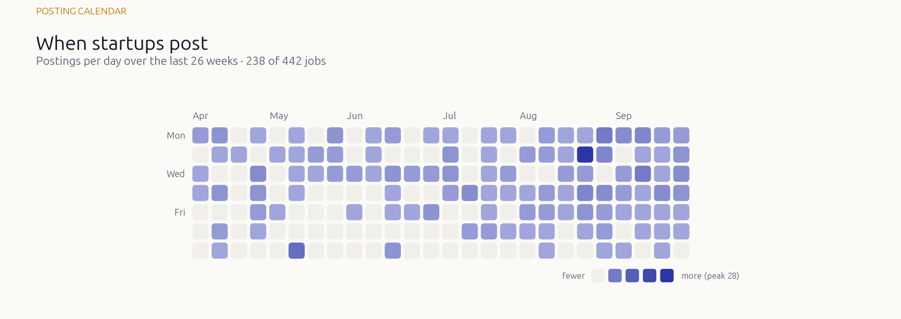

# 🕵️ Job-Search-Agent

> A local-LLM agent that hunts YC startup jobs so I don't have to doom-scroll job boards.

Every day it pulls new-grad roles from [Work at a Startup](https://www.workatastartup.com), digs into each company, judges every job against my profile with an LLM running on my own GPU, and sends one tidy Excel workbook to Telegram. I still apply myself. This is a scout, not an auto-apply bot.

## 🎯 What it optimizes for

| | Signal |
|---|---|
| 🏠 | Remote from India first, then Hyderabad › Bengaluru › rest of India |
| 💰 | Realistic pay in ₹ LPA (dollar salaries converted at live rates) |
| 🧠 | Practical interviews over LeetCode marathons |
| 🤖 | Building with AI: agents, LLM apps, AI products |
| 🎓 | Roles open to new grads |

## 🧩 How it works

```
fetch ─▶ triage ─▶ extract ─▶ research ─▶ assess ─▶ score ─▶ 📊 workbook ─▶ 📲 Telegram
```

- **Fetch:** reads WaaS's own search index and job pages. Fast, structured, no HTML guessing.
- **Triage / extract / assess:** typed JSON from a local LLM, with self-repair when the model slips.
- **Research:** a small tool-using agent checks reviews, interview stories, salaries and funding, and drafts a founder note.
- **Score:** plain arithmetic on the LLM's judgments, so rankings stay comparable across models.
- **Cached everywhere:** only new or changed postings cost GPU time.

**Stack:** LangGraph · Ollama (`qwen3:14b` by default, one config line to swap) · Playwright · SQLite · xlsxwriter

## ⌨️ Commands

Run these from the laptop. They're forwarded over SSH to the GPU box, where the data and the model live. Install once with `uv tool install --editable .` to get a global `job-agent` command that works from any folder.

**Runs**

| Command | What it does |
|---|---|
| `job-agent now` | Start a run right away (`--limit 25` for a quick one, `--wait-hours 3` if the GPU is busy) |
| `job-agent schedule 3` | Run every day at 03:00 (any hour 0–23; `--once` for just the next one) |
| `job-agent unschedule` | Remove all scheduled runs |
| `job-agent status` | GPU headroom, running and scheduled runs, last run's numbers |
| `job-agent logs` | Tail of the latest run log |

**Browse results (no GPU needed)**

| Command | What it does |
|---|---|
| `job-agent top` | Best-scoring jobs (`--tab remote_india`, `-n 30`) |
| `job-agent show <id>` | Everything known about one job: facts, judgment, pay, research |
| `job-agent stats` | Per-run metrics table, and refreshes the charts below |

**🤖 LLM helpers (use the GPU when it's free)**

| Command | What it does |
|---|---|
| `job-agent ask "remote AI jobs above 20 LPA?"` | An agent searches your job database and answers |
| `job-agent pitch <id>` | Founder message, cover note and subject line in your voice |
| `job-agent prep <id>` | Interview prep: likely rounds, topics, questions with answer pointers |
| `job-agent tailor <id>` | Which projects to lead the resume with, rewritten bullets, gaps |

Add `--telegram` to any helper to get the result on your phone.

**Setup and maintenance:** `login` (WaaS sign-in), `doctor` (preflight checks), `fetch`, `report`, `run`, `notify-test`.

## 📈 How it performs

Numbers from real runs on an RTX 2000 Ada (16 GB) with `qwen3:14b`. `job-agent stats` refreshes these charts, which follow GitHub's light or dark theme.

<picture>
  <source media="(prefers-color-scheme: dark)" srcset="docs/metrics/hero-dark.png">
  
</picture>

<picture>
  <source media="(prefers-color-scheme: dark)" srcset="docs/metrics/flow-dark.png">
  
</picture>

<picture>
  <source media="(prefers-color-scheme: dark)" srcset="docs/metrics/latency-dark.png">
  
</picture>

### 🗺️ The market it sees

<picture>
  <source media="(prefers-color-scheme: dark)" srcset="docs/metrics/market-dark.png">
  
</picture>

<picture>
  <source media="(prefers-color-scheme: dark)" srcset="docs/metrics/calendar-dark.png">
  
</picture>

Each run records per-stage time, per-call latency, tokens/sec, repair and failure counts, research tool calls and GPU memory peak, so models and prompts can be compared run by run.

## ⚡ Set up your own

```bash
uv sync
cp config.example.yaml config.yaml && cp profile.example.yaml profile.yaml   # make them yours
cp .env.example .env                                                          # Telegram bot token + chat id
uv run job-agent login      # sign in to WaaS once
uv run job-agent doctor     # GPU, Ollama and session checks
uv run job-agent now --limit 25
```

On the GPU box, set `lab.host: local` in its `config.yaml`. Everywhere else, point `lab.host` at it.
